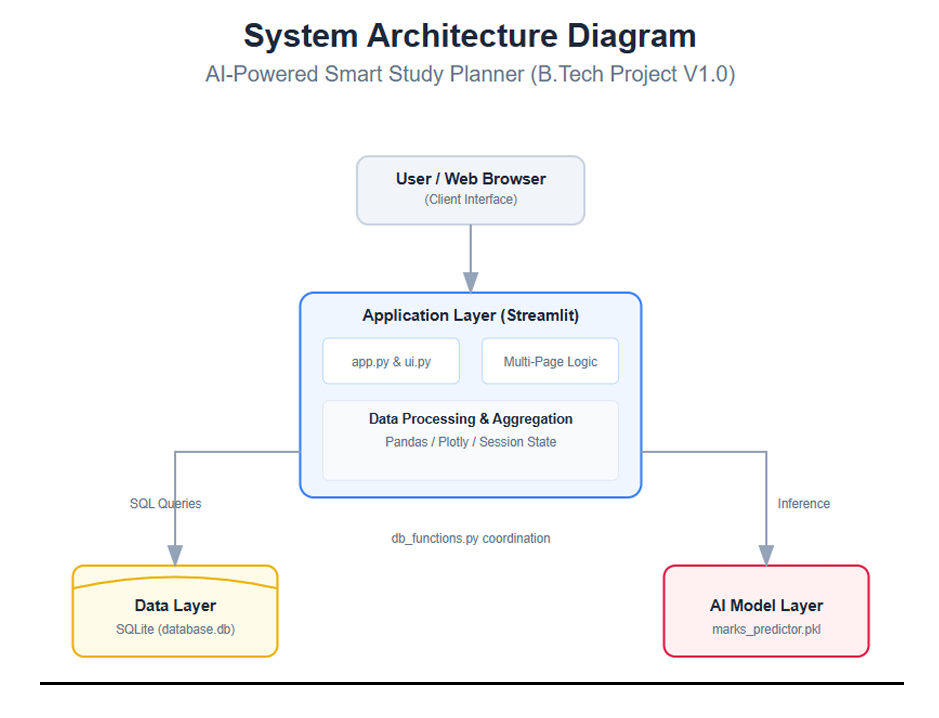

# 🎓 EduPulse AI — Smart Study Planner & Performance Analytics (v1.0)

[](https://share.streamlit.io)
[](https://www.python.org/)
[](https://scikit-learn.org/)

> **Predictive Academic Analytics & Proactive Study Habit Optimization System** > Developed by **Priyo Chand** | Department of Computer Science & Engineering (Cyber Security & Data Science)

---

## 📌 Executive Summary

Traditional study planners act as passive, retrospective logs—tracking time spent without offering insight into cognitive effectiveness or forecasted semester grades. 

**EduPulse AI** shifts academic planning from *reactive tracking* to *proactive forecasting*. Powered by a **Random Forest Regressor** pipeline and interactive **Plotly time-series visualizations**, the platform provides:
1. **Real-time predicted exam outcomes** based on daily study habits, sleep duration, focus intensity, and attendance.
2. **The "Semester Performance Wave"**: A continuous, cubic-spline smoothed curve tracking overall academic momentum.
3. **Adaptive Weak-Subject Diagnostics**: Automated detection of neglected or vulnerable courses with customized recovery missions.

---

## 🚀 Key Features

* 🔐 **Multi-User Authentication & Security:** Custom user registration, credential verification via SHA-256 hashing, secret recovery word password resets, and user profile management.
* 📈 **Semester Performance Wave (Dashboard):** Aggregates daily multi-subject logs into a holistic daily performance index, smoothed using spline interpolation to detect momentum dips before exam cycles.
* 📝 **Predictive Study Logging & Pomodoro Timer:** Interactive session logger with a built-in Pomodoro focus timer that automatically syncs logged study durations to input features.
* 🧠 **AI Study Plan & Priority Missions:** Dynamically computes subject-wise averages, flags the critical weak subject, compares study duration vs. focus score, and generates targeted recovery to-dos.
* 🗄️ **Data Portability & Relational Persistence:** Fully managed SQLite database schema (`database.db`) with support for raw CSV exports and personal academic ID management.

---

## 🏗️ System Architecture




---

## 🛠️ Tech Stack

| Layer | Technologies Used |
| :--- | :--- |
| **Frontend UI** | [Streamlit](https://streamlit.io/), HTML5/CSS3 Custom Badges |
| **Analytics & Visualization** | [Plotly Express & Graph Objects](https://plotly.com/python/), Pandas, NumPy |
| **Machine Learning** | [Scikit-Learn](https://scikit-learn.org/) (`RandomForestRegressor`, `ColumnTransformer`, `OneHotEncoder`) |
| **Database & Security** | SQLite3, `hashlib` (SHA-256 Hashing) |
| **Environment / Versioning**| Python `venv`, Git, GitHub |

---

## 📂 Project Directory Structure

```text
smart-study-planner/
├── .streamlit/             # Streamlit theme and UI configurations
├── assets/                 # Application branding and logos
│   └── logo.png
├── data/                   # Relational database storage
│   └── database.db
├── model/                  # Data generation & ML training pipelines
│   ├── generate_data.py    # Synthetic student habit dataset generator
│   ├── train_model.py      # Random Forest training & evaluation script
│   └── marks_predictor.pkl # Serialized Scikit-Learn pipeline
├── pages/                  # Streamlit Multi-Page routing
│   ├── 1_📊_Dashboard.py   # Semester Wave, KPI badges & donut chart
│   ├── 2_📝_Log_Study.py   # Daily habit logger, Pomodoro timer & inference
│   ├── 3_🧠_Study_Plan.py  # Weak-subject AI mission recommendations
│   └── 4_👤_Profile.py     # Academic ID card, profile settings & CSV export
├── utils/                  # Core backend helper modules
│   ├── db_functions.py     # SQLite schemas, CRUD queries, auth logic
│   └── ui.py               # Standardized headers & footers
├── .gitignore              # Standard Git exclusion file
├── app.py                  # Main entry point & authentication portal
├── README.md               # Project documentation
└── requirements.txt        # Production dependency specifications
